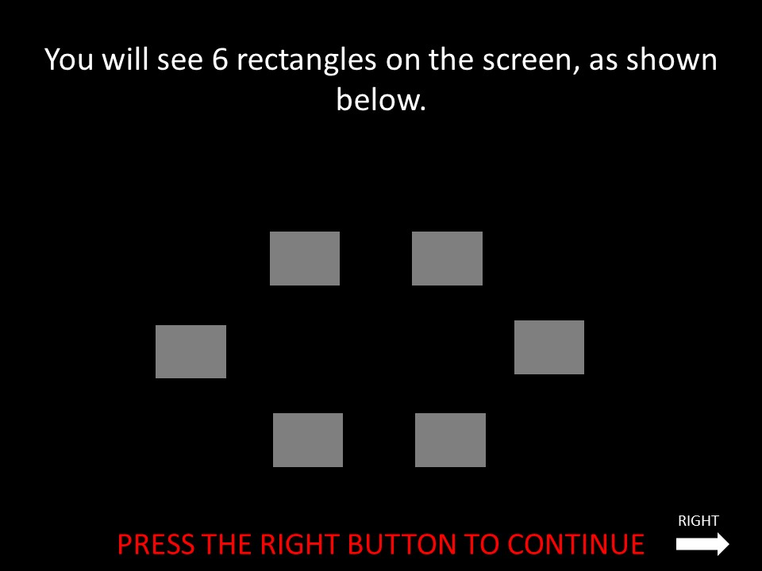

# README for the Sequential Planning Task



# **SUMMARY**

Subjects are presented with 6 boxes on screen, where they must traverse around the boxes in order to get the most points.
Each transions from 1 box to the other is fixed with the same value.

Because, the task isn't as straight forward and can be difficult, This task includes practice runs that is in depth to help the subject learn the task. These are broken down into differente 'RP' runs.

- ### RP1:

   A free training phase lets the participant explore the maze. Duration can be specified by params.file .

- ### RP2:
   
   - Section 1
   
      A goal training phase presents the participant with tasks to be solved (You start at X, your goal is Y, you have Z moves). A task is repeated until solved successfully and tested on 3 depths.
      Depths here refers to the number of moves(Z) need to get to Y.

      - Depth 1: Where participants are tested on path of 1 length  
      - Depth 2: Where participants are tested on path of 2 length
      - Depth 3: Where participants are tested on path of 3 length

   - Section 2

      A 'testing' phase where we test them on only depth 1 move. If they get more than 1 error, we
      repeat Section 2 only.

   **Administrators can skip over each test by pressing the 's' key**


- ### PR3:

   A free training phase lets the participant explore the maze and the rewards attached to each transition/move. The duration can be specified by params.freeTrainingDuratiosn2.

- ### PR4:

   - Section 1
      
      Task Training phase with 3 parts. (also called 3-3-3)
      - Part A:
         3 Trials where subject enters moves based on certain depth without time contraints. Feedback is shown 
      - Part B:
         3 Traisl where subject enters moves. Sequence shown later. Feedback not shown
      - Part C:
         3 Trials where subject waits 9 seconds to make a move. They are then given 2.5 seconds to finish the move sequence.

   - Section 1a:

      Task Training phse with 3 parts. (3-3-3)
      Similar to Section 1 except we remove all outside transitions except top left and and top right transitions.
      This is so subjects has the chance to learn different ways to maximize their gains without relying solely on outside transitions.
      Subject must also only pick the path that gains the max points, if they fail to do so, a new set of pratice will restart the part.

      Each Part will repeat a max of 5 tries until subject correctlly gets all 3 trials in a row
      - Part A: Same as Section 1 Part A
      - Part B: Sams as Section 1 Part B
      - Part C: Same as Section 1 Part C

      *tries record in the params file ie. training1a_part_a_1_tries = first attempt of section 1a part a*
   - Section 2:
      
      A path test phase where participants are tested on the transition values.
      Through multiple choice. If more than 1 error during this test, we repeat all the way to Section 1.

   **Administrators can skip over the test by pressing the 's' key**
   The number of attemps will be saved to the params file. under 'path_test_tries'.


  
## Main Scan Session 


- ### R[1,2,3]:

   Repated Trials similar to Part C of RP4.
   If show_example is True in the params file, then during instructions, subject is shown 6 example trials before actual 'run'

   Runs number is dependent on study

# OUTCOMES
There are 5 differente types of outcomes.

1) Optimal no large loss correct    (ONLL Correct)
   Optimal sequence chosen where this does not include a large loss

2) Optimal large loss correct       (OLL Correct)
   Optimal sequence chosen where this includeds a large loss

3) Aversive Planning(AP)
   The best sequence that avoids large losses chosen when the optimal sequence includes as least one large loss

4) Optimal no large loss error (ONLL error)
   Suboptimal sequence chose for this trial type

5) Optimal large loss error (OLL error)
   All suboptimal, sequence chosen for this trial type, not including aversive pruning


# **TRIAL STRUCTURE**
```
[         instructions         ] ->
^                              ^
INSTRUCT_ONSET                 TASK_ONSET


|<----------------------------------------------- total trial duration ---------------------------------------------------------->|
[  show states  ] -> [     response      ] -> [       animation        ]  -> [    feedback    ] -> [      fixation  shown        ]
+---------------+    +-------------------+    +------------------------+     +----------------+    +-----------------------------+
|   9s duration |    |  2.5s duartion    |    |2.25s - 3.75s duration  |     |   1s duration  |    |   ~ variable duration       |
+---------------+    +-------------------+    +------------------------+     +----------------+    +-----------------------------+
|   planning    |    |  to enter moves   |    |  to show anim          |     | to show points |    | variable about duratio from | 
|               |    |                   |    |                        |     |                |    |TRIAL_ONSET to FIXATION_ONSET|
^                    ^                        ^                              ^                     ^
TRIAL_ONSET          RESPONSE_ONSET           ANIMATION_ONSET                FEEDBACK_ONSET        FIXATION_ONSET
PLANNING_ONSET       RESPONSE                                                OUTCOME

total trial duration is dependent on the number of depths of each trial.
This is because during the animation, we show the arros for .75 s for each 'depth'.
For this reason Total Trial Duration is as follows:
* Depth 3 - 15.75 seconds
* Depth 4 - 16.50 seconds
* Depth 5 - 17.25 seconds

```

# **INPUT DETAILS**

```
EACH LINE CODES: one trial
COLUMN 1: Trial Type (depth)
COLUMN 2: Initial State
COLUMN 3: Goal State (used for practice runs) 
COLUMN 4: Duration 
COLUMN 5: 
COLUMN 6: Correct Category

TRIAL ORDER IS: fixed
```

# **OUTPUT DETAILS**

```
INSTRUCT_ONSET (1)
response_time: not used
response: not used
result: not used

TASK_ONSET (2)
response_time: time between INSTRUCT_ONSET and TASK_ONSET
response: not used
result: not used

TRIAL_ONSET (3)
response_time: not used
response: not used
result: not 
trial_type: depth 

PLANNING_ONSET (4)
response_time: not used
response: not used
result: initial_state
trial_type: depth 

RESPONSE_ONSET (5)
response_time: time since PLANNING_ONSET
response: not used
result: not used
trial_type: depth 

ANIMATION_ONSET (6)
response_time: not used
response: not used
result: not used

FIXATION_ONSET (7)
response_time: not used
response: not used
result: duration

RESPONSE (8)
response_time: time since PLANNING_ONSET
response: button pressed. 1 for right, -1 for left
result: points
trial_type: {initial state}_{depth_value}_{index key number. i.e the 3rd key pressed, indext starts at 0}

FEEDBACK (9)
response_time: not used
response: not used
result: points

OUTCOME (10)
response_time: not used
response: not used
result: 1 of the 5 outcomes. (ONLL_correct, OLL_correct, AP, ONLL_error, OLL_error). see OUTCOME for explanation.

BREATHING_LOAD (11)
response_time: not used
response: not used
result: breathing load response

EXTENDING_TIME (12)
response_time: duration from TRIAL_ONSET to END of ANIMATION
response: not used
result: amount of seconds added to trial

POINTS_ONSET (13)
response_time: duration of anmation flip
response: not used
result: point value of the the transition

```